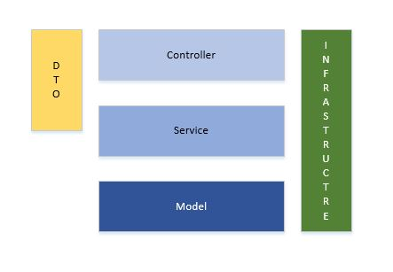
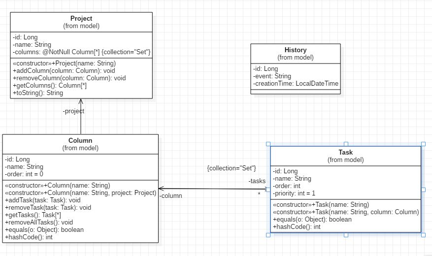
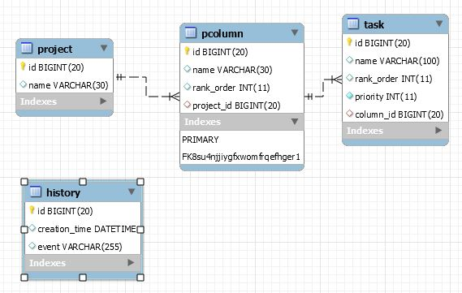

# Proposition d'architecture de projet Spring Boot Rest Controller

## Avant propos

Ce repository est associé à une project type Kanban accessible via le menu de GitHub, les cards du kanban proviennent des issues.

C'est là que vous verrez les améliorations qui restent à faire.

### Ce qui m'a semblé important de mettre en avant dans ce projet
* structure en couches : model, service et controller
* la notion de DTO et leur transformation
* des test unitaires pour la plupart des couches
* le système d'évènement d'application de Spring
* les relations bidirectionnelles avec JPA
* l'utilisation de Mysql pour l'exécution et de H2 pour les tests (avec son gestionnaire web)
* la creation du shéma SQL pour le déploiement
* l'utilisation de profil de configuration
* l'utilisation de configuration des messages texte, dans le but d'être internationalisé

### Ce que vous ne trouverez pas encore dans ce projet mais parfois disponible dans mes autres repos 
* Spring security (bientôt JWT dans une branche à part)
* Interface web (bientôt Angular)
* Flyway pour le versioning du shéma de la base de données
* Envoi de mails
* Upload de fichier
* Export PDF et Excel (il existe un module Jasper embarqué a tester)
* les files d'attentes de messages (MQ pour Message Queue)
* les actuatators

### Shémas

## Layers 

## UML 

## SQL 

### Quelques liens utiles

https://www.baeldung.com/database-migrations-with-flyway

https://fr.wikipedia.org/wiki/Principe_de_responsabilit%C3%A9_unique

https://georgik.rocks/spaghetti-lasagna-and-raviolli-code/

https://fr.wikipedia.org/wiki/Grande_boule_de_boue

https://spring.io/blog/2015/07/14/microservices-with-spring
